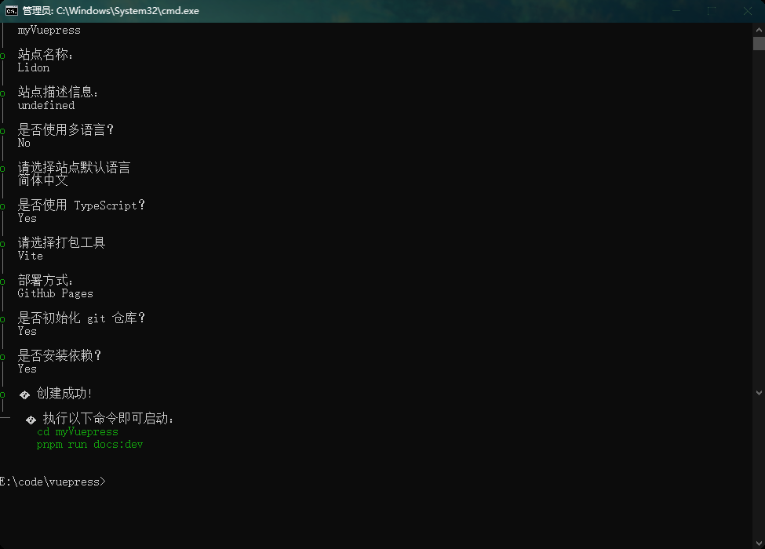

# Lindon's personal blog

#### 一、Use of the Site [vuepress](https://vuepress.vuejs.org/) and [vuepress-theme-plume](https://github.com/pengzhanbo/vuepress-theme-plume) build generation。


- vue3 + ts + vite + router construct
- This project can meet the needs of `blog`, `notes`, `knowledge base`, `product documentation`

#### 二、Create a project

- Create using tools such as `pnpm`, `yarn`, and `npm` (recommended `pnpm`)

```js
// pnpm install

pnpm create vuepress-theme-plume@latest

```
- Create Diagram



####  三、Install dependencies

```js
pnpm i
```

####  四、startup project

```js

// Start development service
pnpm docs:dev

// Build production package
pnpm docs:build

// Build production package
pnpm docs:preview

// Update vuepress and themes
pnpm vp-update
```

####  Deploy to GitHub Pages

Theme has been created github actions: `.github/workflows/docs-deploy.yml`，You also need to make the following settings in the GitHub repository：

- [ ] `settings > Actions > General`，Pull to the bottom of the page, in `Workflow permissions` Next, check the box `Read and write permissions`，And click the save button

- [ ] `settings > Pages`, in `Build and deployment` centre，`Source` select `Deploy from a branch`, `Branch` select `gh-pages`，And click the save button
  (The first creation may not have a 'gh pages' branch. You can complete the above settings first, push the code to the main branch once, and wait for the' GitHub actions' to complete before setting it up.)

- [ ] Modify the 'base' option in 'docs/. vuepress/config. ts':
  - If you are planning to publish to 'https://<USERNAME>. github. io/', you can skip this step because 'base' defaults to '/'.
  - If you are planning to publish to<https://<USERNAME>. lithub. io/<REPO>/>, which means your warehouse address is` https://github.com/ <USERNAME>/<REPO>` ， Then set 'base' to '/<REPO>/'.

If you need to customize a domain name, please refer to [Github Pages document](https://docs.github.com/zh/pages/configuring-a-custom-domain-for-your-github-pages-site/about-custom-domains-and-github-pages)

## document

- [vuepress](https://vuepress.vuejs.org/)
- [vuepress-theme-plume](https://theme-plume.vuejs.press/)